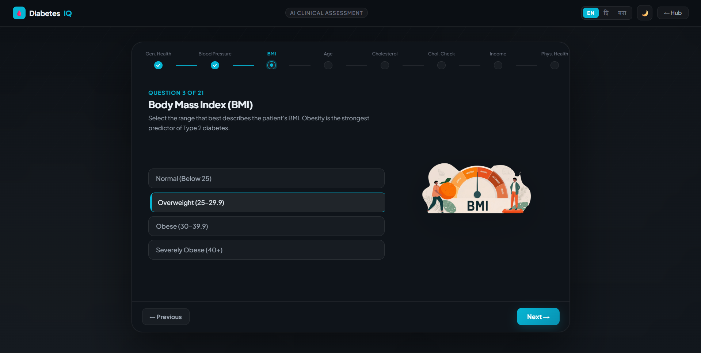

# 🩺 Diabetes Risk Assessment System

> A full-stack web application that helps users assess their risk of developing diabetes through **lifestyle questionnaires** and a **machine learning engine** — built as a 3rd Year University Team Project.

---

## 📸 Screenshots

| Assessment Hub | Lifestyle Check | Risk ML Engine | Result |
|---|---|---|---|
|  |  |  |  |

---

## 📋 Table of Contents

- [About the Project](#-about-the-project)
- [Features](#-features)
- [Tech Stack](#-tech-stack)
- [Project Structure](#-project-structure)
- [Getting Started](#-getting-started)
- [How It Works](#-how-it-works)
- [Team](#-team)
- [Disclaimer](#-disclaimer)

---

## 🧠 About the Project

This system was built to give people a quick, accessible, and educational way to understand their diabetes risk — without needing to see a doctor first.

It has **two separate modules** that work together:

1. **Lifestyle Check** — A friendly quiz that asks about your daily habits (diet, sleep, exercise, etc.) and gives you a risk score based on a custom scoring algorithm.

2. **Risk ML Engine** — A machine learning model (XGBoost) trained on the **BRFSS 2015 Health Indicators dataset** (253,000+ real records) that predicts diabetes risk based on clinical health factors.

Both modules are launched from a single **Assessment Hub** landing page.

---

## ✨ Features

- 🎯 **Two-mode risk assessment** — Lifestyle quiz + ML-based clinical prediction
- 📊 **Detailed risk breakdown** — Shows exactly *why* your risk is low/moderate/high
- 🤖 **XGBoost ML model** — Trained with class-weight balancing and threshold optimisation
- 💅 **Animated UI** — Built with React + Framer Motion for smooth, engaging experience
- 🔒 **No personal data stored** — All processing is done in real-time
- 📱 **Responsive design** — Works on desktop and mobile
- ⚡ **One-command startup** — Single PowerShell script launches all 4 services

---

## 🛠 Tech Stack

### Frontend
| Technology | Purpose |
|---|---|
| HTML / CSS / JavaScript | Assessment Hub landing page |
| React 18 + Vite | Lifestyle Check & Risk ML Engine frontends |
| Framer Motion | Animations |
| React Icons | UI icons |

### Backend
| Technology | Purpose |
|---|---|
| Python + Flask | REST API for both modules |
| Flask-CORS | Cross-origin request handling |

### Machine Learning
| Technology | Purpose |
|---|---|
| XGBoost | Diabetes risk classification |
| scikit-learn | Preprocessing, metrics, scaling |
| imbalanced-learn | Dataset balancing |
| pandas + NumPy | Data processing |

---

## 📁 Project Structure

```
diabetes-risk-system/
│
├── start_all.ps1                        # ⚡ One script to start everything
│
├── assessment-hub/                      # Landing page (HTML/CSS/JS)
│   ├── index.html
│   ├── script.js
│   └── styles.css
│
├── lifestyle-check/                     # Lifestyle quiz module
│   ├── backend/
│   │   ├── app.py                       # Flask API on port 5000
│   │   ├── predict.py
│   │   ├── train.py
│   │   └── requirements.txt
│   ├── frontend/
│   │   ├── src/
│   │   │   ├── App.jsx
│   │   │   ├── components/
│   │   │   │   ├── Navbar.jsx
│   │   │   │   ├── ProgressNav.jsx
│   │   │   │   ├── QuestionCard.jsx
│   │   │   │   └── ResultCard.jsx
│   │   │   └── styles.css
│   │   ├── public/stickers/             # Question illustration images
│   │   ├── package.json
│   │   └── vite.config.js               # Runs on port 5173
│   └── models/
│       ├── prediabetes_model.pkl
│       └── label_encoder.pkl
│
└── risk-ml-engine/                      # XGBoost ML prediction module
    ├── backend/
    │   ├── app.py                       # Flask API on port 5001
    │   ├── train_model.py
    │   ├── preprocessing.py
    │   ├── predict_new_data.py
    │   ├── models/
    │   │   ├── final_xgb_model.pkl
    │   │   ├── scaler.pkl
    │   │   └── threshold.pkl
    │   ├── data/
    │   │   └── diabetes_012_health_indicators_BRFSS2015.csv
    │   └── requirements.txt
    └── frontend/
        ├── src/
        │   ├── App.jsx
        │   ├── components/
        │   │   ├── Navbar.jsx
        │   │   ├── ProgressNav.jsx
        │   │   ├── QuestionCard.jsx
        │   │   └── ResultCard.jsx
        │   └── styles.css
        ├── public/stickers/             # Question illustration images
        ├── package.json
        └── vite.config.js               # Runs on port 5174
```

---

## 🚀 Getting Started

### Prerequisites

Make sure you have these installed:
- [Node.js](https://nodejs.org/) (v18 or above)
- [Python](https://www.python.org/) (v3.9 or above)
- [Git](https://git-scm.com/)

---

### 1. Clone the Repository

```bash
git clone https://github.com/shivamburkul/diabetes-risk-system.git
cd diabetes-risk-system
```

---

### 2. Install Dependencies (First Time Only)

Install Python dependencies for both backends:

```bash
cd lifestyle-check/backend
pip install -r requirements.txt
cd ../../risk-ml-engine/backend
pip install -r requirements.txt
cd ../..
```

Install Node dependencies for both frontends:

```bash
cd lifestyle-check/frontend
npm install
cd ../../risk-ml-engine/frontend
npm install
cd ../..
```

---

### 3. Start the Project

From the **root folder**, run the PowerShell script to launch all 4 services at once:

```powershell
.\start_all.ps1
```

This will automatically start:

| Service | URL |
|---|---|
| Lifestyle Check Backend | `http://localhost:5000` |
| Risk ML Engine Backend | `http://localhost:5001` |
| Lifestyle Check Frontend | `http://localhost:5173` |
| Risk ML Engine Frontend | `http://localhost:5174` |
| Assessment Hub | Opens automatically in your browser |

> **Note:** `start_all.ps1` is a Windows PowerShell script. If you are on Mac/Linux, start each service manually using the commands below.

---

### Manual Start (Mac / Linux)

Open 4 separate terminal windows and run one command in each:

**Terminal 1 — Lifestyle Backend:**
```bash
cd lifestyle-check/backend && python app.py
```

**Terminal 2 — Risk ML Backend:**
```bash
cd risk-ml-engine/backend && python app.py
```

**Terminal 3 — Lifestyle Frontend:**
```bash
cd lifestyle-check/frontend && npm run dev
```

**Terminal 4 — Risk ML Frontend:**
```bash
cd risk-ml-engine/frontend && npm run dev
```

Then open `assessment-hub/index.html` in your browser.

---

## ⚙️ How It Works

### Lifestyle Check — Scoring System

The lifestyle questionnaire scores your answers across **10 risk categories**:

| Category | Max Score |
|---|---|
| Age | 15 |
| Weight / BMI | 20 |
| Waist circumference | 10 |
| Family history | 15 |
| Physical activity | 10 |
| Diet & sugary drinks | 15 |
| Alcohol & smoking | 12 |
| Symptoms (thirst, urination, fatigue, etc.) | varies |
| Sleep & stress | 15 |
| Female-specific factors (GDM / PCOS) | 10 |

**Risk Levels:**
- 🟢 Low Risk — below 30%
- 🟡 Moderate Risk — 30% to 60%
- 🔴 High Risk — above 60%

---

### Risk ML Engine — XGBoost Model

- **Dataset:** CDC BRFSS 2015 Health Indicators (253,680 records, 21 features)
- **Model:** XGBoost Classifier with optimised decision threshold
- **Balancing:** Class-weight balancing for imbalanced dataset
- **Evaluation:** F1-Score, ROC-AUC, Confusion Matrix

**Input features include:** BMI, Blood Pressure, Cholesterol, Physical Activity, Smoking status, General Health rating, Age, Income, Education and more.

---

## 👥 Team

This project was built as a **3rd Year University Team Project** by:

| Name | GitHub | Role |
|---|---|---|
| Pranav Gajanan Dighade | [@connectpranav](https://github.com/connectpranav) | Leader |
| Ajay Bhanwarlal Chaudhary | [@ajay262628](https://github.com/ajay262628) | Member 1 |
| Shivam Gajanan Burkul | [@shivamburkul](https://github.com/shivamburkul) | Member 2 |
| Faiz Ishaque Chauhan | [@faizchauhan18-creator](https://github.com/faizchauhan18-creator) | Member 3 |

---

## ⚠️ Disclaimer

> This tool is for **educational and informational purposes only**. It is **not a medical diagnosis** and should not replace professional medical advice. If you have concerns about your health, please consult a qualified healthcare professional.

---

## 📄 License

This project was built for academic purposes as part of a university module.

---

<div align="center">
  <p>Made with ❤️ by the Diabetes Risk System Team</p>
</div>